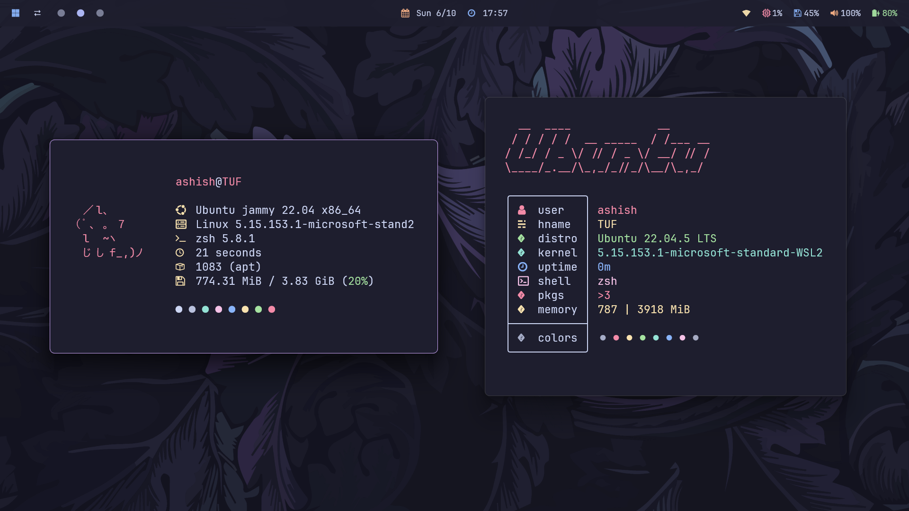
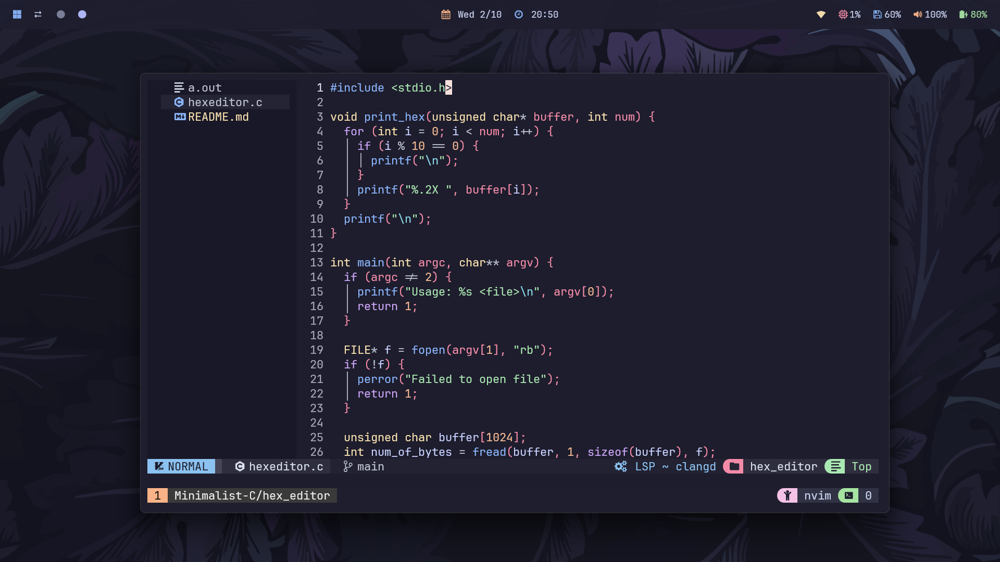
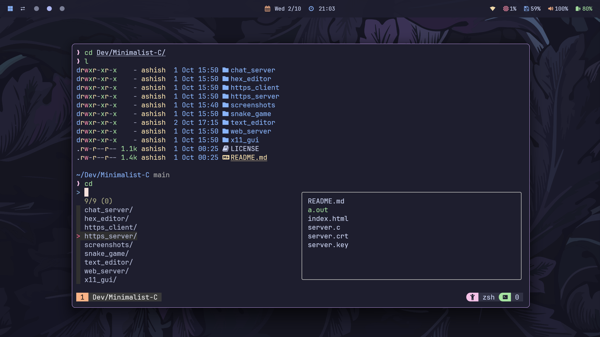
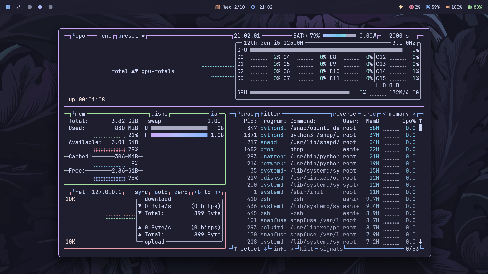

<h1 align="center">🌿 dotfiles</h1>

<div align="center">
  <a href="#-about"><kbd> <br> 🌷 About <br> </kbd></a>&ensp;&ensp;
  <a href="#-setup"><kbd> <br> 🔧 Setup <br> </kbd></a>&ensp;&ensp;
  <a href="#-credits"><kbd> <br> 🎉 Credits <br> </kbd></a>&ensp;&ensp;
</div>

<br>






<div align="center">
<p>
<a href="https://github.com/ashish0kumar/dotfiles/stargazers"><a>&nbsp;&nbsp;
<a href="https://github.com/ashish0kumar/dotfiles/"></a>&nbsp;&nbsp;
<a href="https://github.com/ashish0kumar/dotfiles/commits/main/"></a>&nbsp;&nbsp;
<a href="https://github.com/ashish0kumar/dotfiles/LICENSE"></a>&nbsp;&nbsp;
</p>
</div>


## 🌷 About

Welcome devs! 👋 Here you'll find all the configuration files that power my development environment on WSL2 (Linux), meticulously curated to provide an efficient, productive, and aesthetically pleasing setup.

> [!NOTE]
> All configurations related to Windows are maintained in this repository -> [windots](https://github.com/ashish0kumar/windots)

## ✨ Features

**Included configs:**

- 🐚 **zsh**
- ⚡ **powerlevel10k**
- 🖥️ **tmux**
- 🔮 **neovim (nvchad)**
- 📂 **lf** 
- 📊 **btop**
- 🚀 **fastfetch**

<hr/>

## 🌸 Core CLI Info

> [!Note]
> Some of this apps have the config files included in the repo, which are marked with ⚙️. Also, my favorite programs and tools are marked with 💖.


| 📚 Entry                           | ✨ App                  |
|------------------------------------|--------------------------|
| **Shell**                              | 💖 [zsh](https://zsh.sourceforge.io/) [⚙️](https://github.com/ashish0kumar/dotfiles/blob/master/.zshrc) |
| **Terminal Emulator**                  | [windows terminal](https://github.com/microsoft/terminal) [⚙️](https://github.com/ashish0kumar/windots/blob/main/.config/terminal/settings.json) |
| **Terminal Multiplexer**               | 💖 [tmux](https://github.com/tmux/tmux) [⚙️](https://github.com/ashish0kumar/dotfiles/blob/master/.config/tmux/tmux.conf) |
| **Shell Prompt**                       | [powerlevel10k](https://github.com/romkatv/powerlevel10k) [⚙️](https://github.com/ashish0kumar/dotfiles/blob/master/.p10k.zsh) |
| **Text Editor**                        | 💖 [neovim](https://neovim.io/) [⚙️](https://github.com/ashish0kumar/dotfiles/tree/master/.config/nvim) |
| **CD Replacement**                     | 💖 [zoxide](https://github.com/ajeetdsouza/zoxide) |
| **LS Replacement**                     | [eza](https://github.com/eza-community/eza) |
| **File Manager**                       | 💖 [lf](https://github.com/gokcehan/lf) |
| **Fuzzy File Finder**                  | 💖 [fzf](https://github.com/junegunn/fzf) |
| **Git TUI**                            | [lazygit](https://github.com/jesseduffield/lazygit) |
| **System Monitor**                     | [btop](https://github.com/aristocratos/btop) [⚙️](https://github.com/ashish0kumar/dotfiles/blob/master/.config/btop/btop.conf) |
| **System Fetch**                       | [fastfetch](https://github.com/fastfetch-cli/fastfetch) [⚙️](https://github.com/ashish0kumar/dotfiles/blob/master/.config/fastfetch/config.jsonc) |

<hr/>

## 🔧 Setup

This repository utilizes [GNU Stow](https://www.gnu.org/software/stow/) for efficient dotfiles management, allowing for easy installation and organization of configuration files.

> [!NOTE]
> I’m using WSL2 for my development environment. <br/>
> If you encounter any issues related to file permissions, symbolic links, or path configurations, please keep in mind that WSL2 may behave differently compared to a native Linux environment. You might need to adjust certain configurations accordingly.

1. **Clone the repository**:
    ```bash
    git clone https://github.com/ashish0kumar/dotfiles.git
    cd dotfiles
    ```

2. **Install GNU Stow**:
    - On Ubuntu/Debian: `sudo apt install stow`
    - On macOS: `brew install stow`

3. **Symlink the configurations**:
    ```bash
    stow .
    ```


## 🔗 Stow Guide
GNU Stow is used to manage symlinks for these configuration files. Each subdirectory of the repo contains the dotfiles for a specific application, and Stow handles linking these to your home directory. 

- To symlink a config:
  ```bash
  stow <folder>
  ```

- To remove a symlinked config:

  ```bash
  stow -D <folder>
  ```

<hr/>


## 📜 License

Feel free to use and modify these dotfiles to suit your needs.


## 🎉 ‎Credits

Big thanks to everyone at [r/unixporn](https://reddit.com/r/unixporn) for inspiring me to make this!

I wanna point out some resources that helped me the most with the setup:

- [Matt-FTW's README](https://github.com/Matt-FTW/dotfiles?tab=readme-ov-file) to help me with the overall design and distribution of the README 🙏
- [GlazeWM](https://github.com/glzr-io/glazewm) for providing an incredible tiling window manager experience that enhances my workflow and productivity ✨
- [Dreams of Code](https://www.youtube.com/@dreamsofcode/videos) / [Dreams of Autonomy](https://www.youtube.com/@dreamsofautonomy/videos) for helping out with almost all of my configs 🔧
- [LierB](https://github.com/LierB/fastfetch) for the fastfetch config presets 📋
- [Catppuccin](https://catppuccin.com) for making the Best Colorscheme Ever 🖌️


## ✍️ Contributing

Part of what makes the open source community special are the contributions. Any contributions will be **highly appreciated!**

If you have any ideas or suggestions to make, feel free to [open an issue](https://github.com/ashish0kumar/dotfiles/issues) or [submit a PR](https://github.com/ashish0kumar/dotfiles/pulls)

<br><br>


<p align="center">
	
</p>
