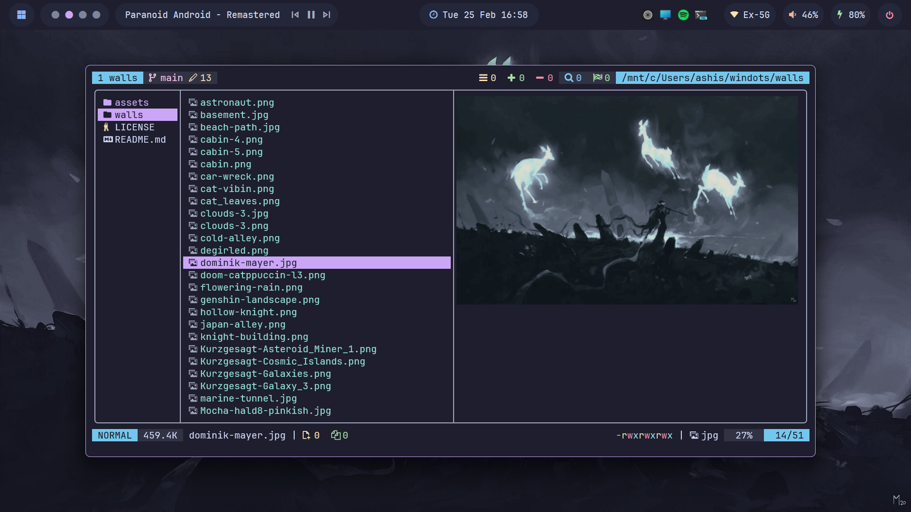

<h1 align="center">🌿 dotfiles</h1>

<p align="center">
  
</p>

<div align="center">
<p>
<a href="https://github.com/ashish0kumar/dotfiles/stargazers"><a>&nbsp;&nbsp;
<a href="https://github.com/ashish0kumar/dotfiles/"></a>&nbsp;&nbsp;
<a href="https://github.com/ashish0kumar/dotfiles/commits/main/"></a>&nbsp;&nbsp;
<a href="https://github.com/ashish0kumar/dotfiles/blob/main/LICENSE"></a>&nbsp;&nbsp;
</p>
</div>

<div align="center">
  
</div>

<div align="center">
  
  
</div>

<div align="center">
  
  
</div>

---

## 🌷 About

Hey there! 👋

Welcome devs! Here you'll find all the configuration files that power my
development environment on WSL2 (Linux), meticulously curated to provide an
efficient, productive, and aesthetically pleasing setup. I created this repo to
help me back up my config files and easily deploy them on a new machine.

The goal is to maintain a simple yet highly customizable and clean environment
that can be easily deployed across multiple machines. These configurations are
designed for my personal use but can serve as a useful starting point for others
looking to streamline their setups.

> [!NOTE]
> All configurations related to my **Windows environment** are maintained in a
> separate repository: [**windots**](https://github.com/ashish0kumar/windots)

---

## ✨ Features

> [!NOTE]
> Some of these apps have the **config files** included in the repo, which are
> marked with ⚙️. Also, my **favorite programs** and tools are marked with 💖.

#### 🖥️ CLI/TUI Apps

| 📚 Entry                 | ✨ App                                                                                                                                                                                                                                                              |
| ------------------------ | ------------------------------------------------------------------------------------------------------------------------------------------------------------------------------------------------------------------------------------------------------------------- |
| **Shell**                | 💖 [zsh](https://zsh.sourceforge.io/) [⚙️](https://github.com/ashish0kumar/dotfiles/blob/main/.zshrc)                                                                                                                                                               |
| **Terminal Emulator**    | [windows terminal](https://github.com/microsoft/terminal) [⚙️](https://github.com/ashish0kumar/windots/blob/main/.config/terminal/settings.json)                                                                                                                    |
| **Terminal Multiplexer** | 💖 [tmux](https://github.com/tmux/tmux) [⚙️](https://github.com/ashish0kumar/dotfiles/blob/main/.config/tmux/tmux.conf)                                                                                                                                             |
| **Shell Prompt**         | [powerlevel10k](https://github.com/romkatv/powerlevel10k) [⚙️](https://github.com/ashish0kumar/dotfiles/blob/main/.p10k.zsh)                                                                                                                                        |
| **Text Editor**          | 💖 [neovim](https://neovim.io/) [⚙️](https://github.com/ashish0kumar/dotfiles/tree/main/.config/nvim)                                                                                                                                                               |
| **CD Replacement**       | 💖 [zoxide](https://github.com/ajeetdsouza/zoxide)                                                                                                                                                                                                                  |
| **LS Replacement**       | [eza](https://github.com/eza-community/eza)                                                                                                                                                                                                                         |
| **Cat Replacement**      | [bat](https://github.com/sharkdp/bat) [⚙️](https://github.com/ashish0kumar/dotfiles/tree/main/.config/bat)                                                                                                                                                          |
| **File Manager**         | 💖 [yazi](https://yazi-rs.github.io/) [⚙️](https://github.com/ashish0kumar/dotfiles/tree/main/.config/yazi)                                                                                                                                                         |
| **Fuzzy File Finder**    | 💖 [fzf](https://github.com/junegunn/fzf)                                                                                                                                                                                                                           |
| **Git**                  | [git](https://git-scm.com/) [⚙️](https://github.com/ashish0kumar/dotfiles/tree/main/.config/git)                                                                                                                                                                 |
| **Git TUI**              | [lazygit](https://github.com/jesseduffield/lazygit)                                                                                                                                                                                                                 |
| **System Monitor**       | [btop](https://github.com/aristocratos/btop) [⚙️](https://github.com/ashish0kumar/dotfiles/blob/main/.config/btop/btop.conf) & [bottom](https://github.com/ClementTsang/bottom) [⚙️](https://github.com/ashish0kumar/dotfiles/blob/main/.config/bottom/bottom.toml) |
| **System Fetch**         | [fastfetch](https://github.com/fastfetch-cli/fastfetch) [⚙️](https://github.com/ashish0kumar/dotfiles/blob/main/.config/fastfetch/config.jsonc)                                                                                                                     |
| **Audio Visualizer** 	   | [cava](https://github.com/karlstav/cava) |

#### 🔍 Other

| 📚 Entry                             | ✨ App                  |
|---------------------------------------|--------------------------|
| **Colorscheme**                       | 💖 [Catppuccin Mocha](https://catppuccin.com) |
| **Font**                  		| [JetBrainsMono Nerd Font](https://www.jetbrains.com/lp/mono/) |
| **Dotfiles Manager**              	| 💖 [GNU Stow](https://www.gnu.org/software/stow/) |

---

## 🔧 Setup

This repository uses [**GNU Stow**](https://www.gnu.org/software/stow/) to
manage dotfiles efficiently by symlinking them into the appropriate locations.

> [!WARNING]
> If you have existing config files, back them up before running `stow .` to avoid overwriting.

Make sure **GNU Stow is installed**

1. **Clone the repository**
   ```bash
   git clone https://github.com/ashish0kumar/dotfiles.git
   cd dotfiles
   ```

2. **Symlink the configurations**
   ```bash
   stow .
   ```

---

## 💫 Star History

[](https://starchart.cc/ashish0kumar/dotfiles)

<br>
<br>

<p align="center">
	
</p>
